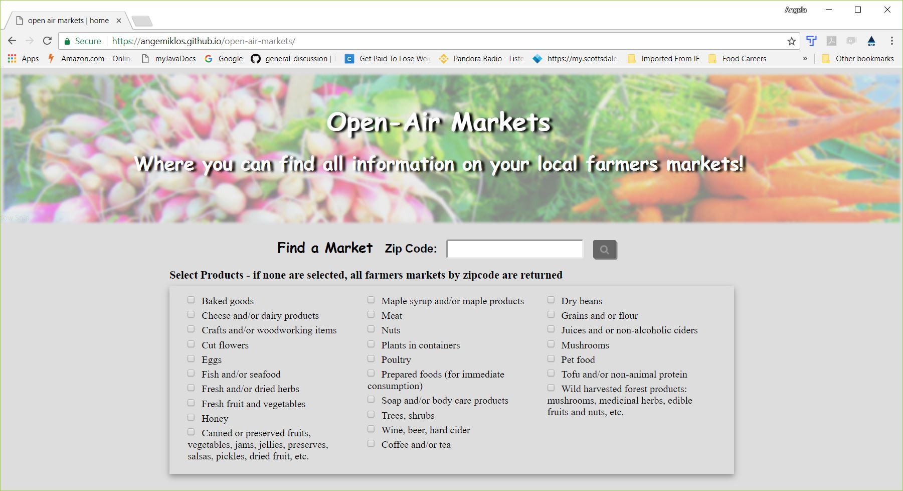

__Open Air Markets__ 
====================

Welcome. May your day be full of sunshine, fresh air and healthy products! 

General Concept
---------------

Open Air Markets provides a place where the user can find a farmers market
close to them and know whether they will be selling the product or 
products they are looking for.  

Future updates hope to include more accurate information and
product and vendor detail, recipes and intelligent links to concepts, ideas and uses for the market products the user intends to buy.

Capabilities
------------
###Initial Home screen

Enter a zip code and receive a list of farmers markets in that area.
If an invalid zip is entered, the user is notified.  

###Invalid Zipcode entered

A filter is provided to
allow the list to be paired down to only the markets which have the
selected products such as baked goods, preserves, fruits and vegetables,
etc. If no product is selected from the filter, then all markets are listed for that area.

###Products selected

The markets in the list are selectable and provide the name of the 
market as provided by the USDA and the distance from the center of the
zip code area.

###Markets List

When a list item (farmers market) is selected, the page changes to
a detailed page on that market.  On the detailed market page, the
user is provided with the following:

* The name of the market
* The market's address
* A google link which will take them to Google Maps with the market pinpointed
   on the map
* A facebook link which searches facebook for a farmers market page
* The market yearly schedule
* The products available at this market

###Market Selected

###Market Details

###Google Link

###Facebook Link

##Technology Used

* HTML
* CSS
* Javascript
* JQuery

##APIs Used

USDA.gov 

##Authors

Angela Miklos - front-end development